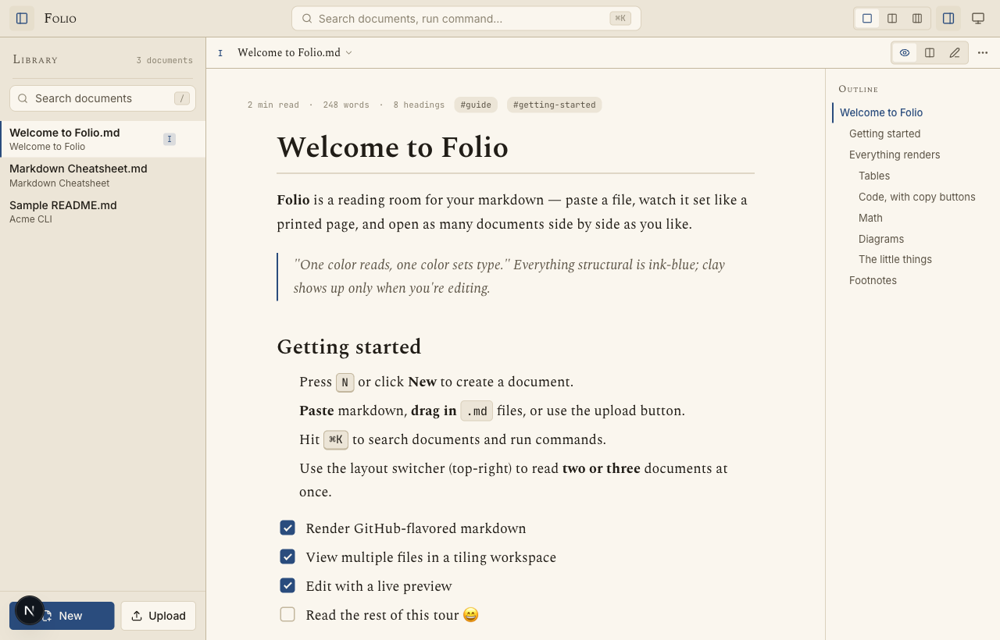
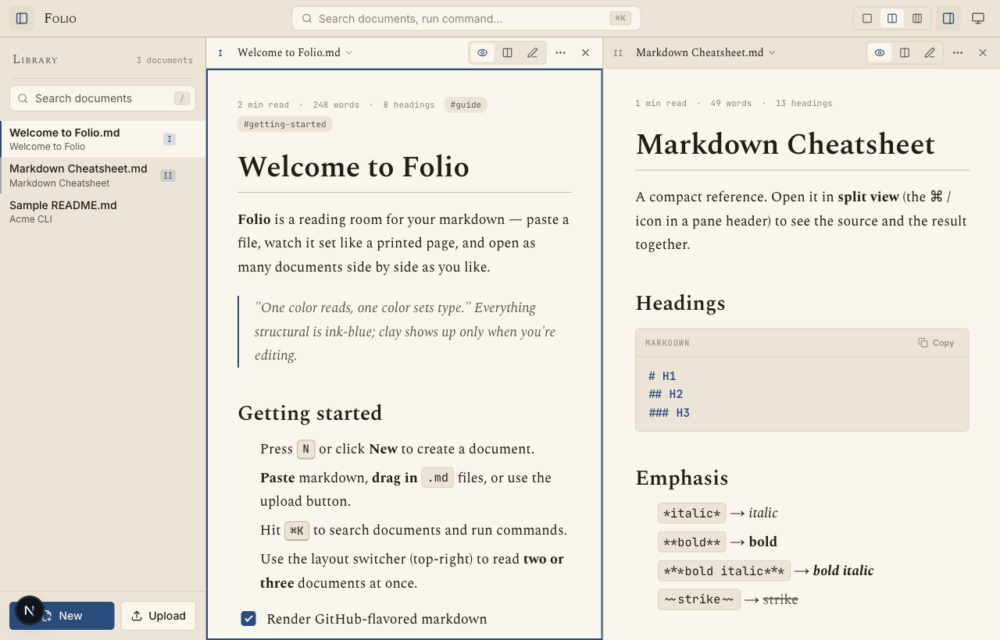
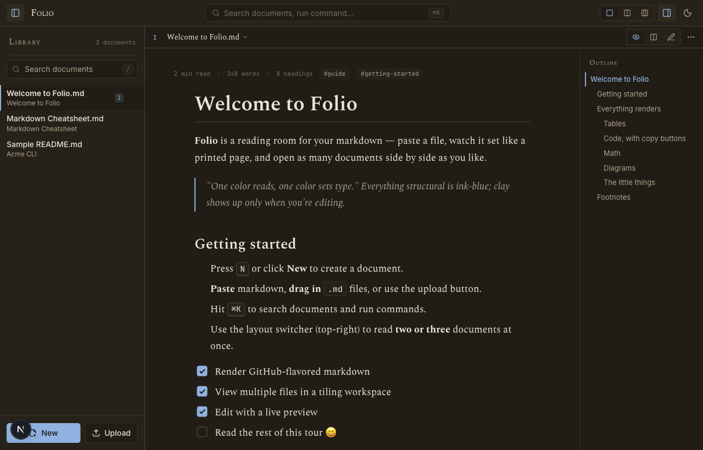
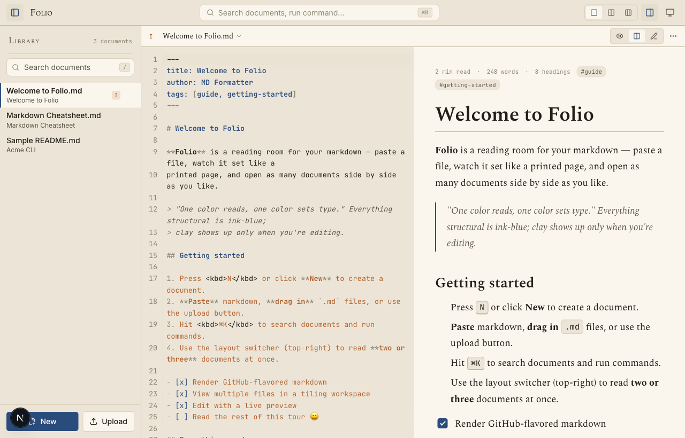
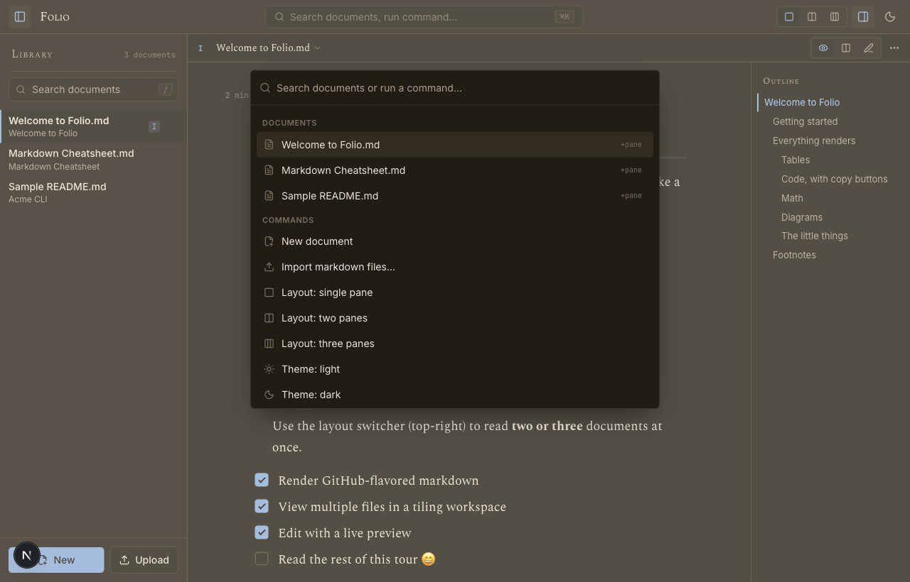

<div align="center">


# Folio

### A typesetter's reading room for markdown — paste a file, watch it set like a printed page, and read many documents side by side.

[](LICENSE)


[](https://github.com/farhanjavedjatt/folio/actions/workflows/ci.yml)

### **[▶ Try the live demo](https://folio-psi-ashy-34.vercel.app)**



</div>

Folio is a **beautiful, modern markdown workspace** that runs entirely in your
browser. Paste or drop a `.md` file, and it renders as a finely typeset page.
Open one document at a time, or tile **two or three side by side** to read and
compare. No account, no server — your documents live in your browser.

> Built with Next.js 16 (App Router), React 19, TypeScript, and Tailwind CSS v4.
> The design language — **"Folio"** — is documented in [`docs/DESIGN.md`](docs/DESIGN.md).

## Screenshots

| Tiling workspace | Dark mode |
| --- | --- |
|  |  |
| **Edit + live preview** | **Command palette (⌘K)** |
|  |  |

## Features

- **File-explorer "Library"** — paste, upload, or **drag-and-drop** `.md` files;
  search, rename (double-click), duplicate, pin, download, and delete. Everything
  persists in your browser (localStorage).
- **Multi-file workspace** — a tiling layout with **1, 2, or 3 panes** side by
  side. Resize panes by dragging the gutter. Each pane has its own folio marker,
  document switcher, and view mode. `⌘1 / ⌘2 / ⌘3` move keyboard focus between panes.
- **Rich rendering** — GitHub-flavored markdown: tables, task lists, strikethrough,
  autolinks, footnotes, emoji shortcodes, and GitHub-style `[!NOTE]` callouts.
  Plus **syntax highlighting**, **KaTeX math** (`$…$` and `$$…$$`), and **Mermaid
  diagrams**. Raw HTML is sanitized.
- **Edit + live preview** — a CodeMirror editor with a synced preview (Read /
  Split / Edit per pane). One-click **Format** tidies the markdown source.
- **Outline** — auto-generated table of contents with scroll-spy.
- **Command palette** — `⌘K` to jump to any document or run any command.
- **Polish** — light / dark / system themes (warm, never slate), copy-code buttons,
  copy/download `.md` & `.html`, print-to-PDF, word count & reading time, keyboard
  shortcuts, a responsive layout, and reduced-motion support.

## Keyboard shortcuts

| Key | Action |
| --- | --- |
| `⌘K` / `Ctrl+K` | Command palette |
| `⌘\` / `⌘B` | Toggle library sidebar |
| `⌘1` / `⌘2` / `⌘3` | Focus pane 1 / 2 / 3 |
| `/` | Focus the document search |
| `N` | New document |

## Getting started

```bash
npm install
npm run dev      # http://localhost:3000
```

Other scripts:

```bash
npm run build      # production build
npm run start      # serve the production build
npm run test       # unit + component tests (Vitest)
npm run typecheck  # tsc --noEmit
npm run lint       # eslint
```

## Deploy

Folio is a static client app, so it deploys anywhere. The fastest path:

```bash
npm i -g vercel
vercel        # follow the prompts; then `vercel --prod`
```

Then put the resulting URL in the **Live demo** link at the top of this README.

## Architecture

```
src/
  app/                 layout (fonts, no-flash theme), page, globals.css (Folio tokens + prose)
  lib/
    store.ts           zustand store (documents, tiling panes, settings) + localStorage persistence
    markdown.ts        react-markdown plugin pipeline, sanitize schema, callouts, front matter, format
    stats.ts toc.ts export.ts files.ts samples.ts   pure utilities
  hooks/               theme, mounted guard, scroll-spy, media query
  components/
    markdown/          MarkdownView, CodeBlock (copy + lang), Mermaid
    editor/            MarkdownEditor (CodeMirror, lazy-loaded)
    workspace/         Workspace shell, TopBar, Sidebar, PaneGrid, DocPane, Outline, CommandPalette…
    ui/                IconButton, Segmented, Menu, CopyButton
```

### Security note

Markdown may contain raw HTML. The pipeline parses it (`rehype-raw`) and then
**sanitizes** it (`rehype-sanitize`) *before* the trusted KaTeX / highlight
transforms run, so user HTML can never inject scripts or event handlers while
math and code highlighting still work.

## Contributing

Contributions are welcome! See [`CONTRIBUTING.md`](CONTRIBUTING.md). Pure logic and
the rendering pipeline (including sanitization) are covered by Vitest; please keep
`lint`, `typecheck`, `test`, and `build` green.

## License

[MIT](LICENSE) © Farhan Javed
